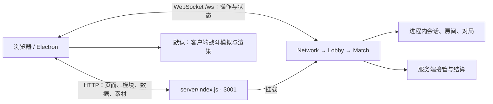

# 卫戍协议：盟约联机版开发文档

本文依据当前源码和部署验收记录编写，核验日期为 **2026-10-09（Asia/Shanghai）**。当前发布版本为 **0.1.1**，WebSocket 协议版本为 **1**；二者分别定义于 [package.json](../package.json) 和 [shared/constants.js](../shared/constants.js)。部署操作见 [云服务器部署说明](../deployment/云服务器部署说明.md)。

## 1. 当前范围与证据边界

这是非官方同人网页联机模拟，整合了用户提供 APK 内的网页运行代码、数据和资源，以浏览器或 Electron 作战终端运行。活动配置为 `act2autochess`，名称为“卫戍协议：盟约”。地图、波次和资源中仍有 `act1autochess_*` 标识，它们被当前配置引用，并不代表应切换到旧原型。

当前房间入口支持 `solo` 和 `coop`：单人房间只有一名真人，同盟房间最多四个席位，可混合真人和 AI。四档难度为 `FUNNY`、`NORMAL`、`HARD`、`ABYSS`，对应标准、险境、绝境、终极模拟。[data/config.json](../data/config.json) 保留八种单人/同盟难度组合；入门协议 `mode_training_1` 虽有数据，但 `inScope:false`，不属于当前房间协议可选模式。

源码包含协议选择、同盟大厅、信息确认、策略选择、机变、休整商店、部署、常规战斗、联防、最终攻势、条件触发的隐秘核心和结果界面。标准单人配置的最终攻势位于第 9 回合，其余当前范围模式位于第 14 回合；部分模式设置第 15 回合隐秘核心，实际进入仍由对局条件决定。存在代码和资源不等于已经完成全流程验收。

本次已确认公网 HTTP、抽样资源一致性及双客户端协议流程；**没有完成整局通关、浏览器渲染或全界面像素对照测试**。本文不作“100% 像素还原”或所有技能、地图、敌人均已正确验证的结论。字体、GPU、屏幕比例、资源回退及模拟规则中的默认值仍需通过实际画面与完整对局核验。

## 2. 运行目录与遗留目录

从项目根目录运行开发命令，实际入口为 `server/index.js`，浏览器入口为 `public/index.html → public/js/main.js`。

| 目录或文件 | 当前作用 |
| --- | --- |
| [server/](../server/) | HTTP/WS 入口、会话、房间、对局规则；其中 `sim/` 也供浏览器复用 |
| [shared/](../shared/) | 浏览器与服务端共同使用的协议、常量、盟约及干员调配规则 |
| [data/](../data/) | JSON 数据、资源清单、地图、波次、数值配置 |
| [public/](../public/) | HTML、原生 ES 模块、CSS、资源、字体和已提供的浏览器依赖 |
| [electron-main.cjs](../electron-main.cjs) | 桌面作战终端，选择远程服务或启动本地服务 |
| [scripts/](../scripts/) | 打包、公网验证及资料整理脚本；并非每个脚本都是当前开发流程所需 |
| [tests/](../tests/) | 当前 `npm test` 执行的两项冒烟测试 |
| [deployment/](../deployment/) | 部署指南和本次验收记录 |
| `dist/` | 生成的 EXE 文件夹、云部署包、修复包及依赖验证产物 |
| [research/apk/full/](../research/apk/full/) | 导入来源和归档材料，含许可证；不是当前 HTTP 根目录 |
| `legacy-prototype/`、`legacy-prototype-tests/`、`public-old/` | 替换前的原型或旧客户端，当前启动入口不使用它们 |
| `client/`、`game/`、`server.mjs` | 旧原型代码，当前 `npm start` 与 EXE 不以它们作为入口 |
| `server/server/`、`shared/shared/`、`data/data/` | 导入时保留的嵌套副本；修改应落在上层运行目录，当前云包和 EXE 打包会排除这些副本 |

`server.mjs` 中的旧 3000 默认值不控制本版服务，不应使用它启动游戏。不要为了消除旧文本而将全部 `3000` 数值替换为 `3001`：模拟时间、生命值和事件缓存等数值具有其他含义。

当前网页通过浏览器 ES 模块和 `public/vendor/` 加载依赖，没有必须先执行的前端打包步骤。[scripts/build-client.mjs](../scripts/build-client.mjs) 指向旧 `client/models.js`，还引用未在当前清单声明的 `esbuild`，**不属于本版必需构建流程**。

## 3. HTTP 与 WebSocket 架构

[server/index.js](../server/index.js) 在同一个 Node HTTP 服务上处理静态资源、健康检查和 WebSocket Upgrade。默认 `HOST=0.0.0.0`、`PORT=3001`；调用 `startServer(opts)` 时显式选项优先，其次是进程环境变量，再使用默认值。测试可传 `port:0` 获得临时端口。



| 路径 | 来源与用途 |
| --- | --- |
| `/` | `public/`；目录入口为 `index.html` |
| `/data/` | 顶层 `data/` JSON |
| `/shared/` | 顶层共享 ES 模块 |
| `/sim/` | `server/sim/` 中允许公开的 `.js`；不公开 Node 专用 `nodeData.js` |
| `/data.js` | 动态生成的浏览器数据适配模块，供模拟模块使用 |
| `/healthz` | `ok`、协议 `version`、发布 `app`、运行时间、连接/会话/房间/对局计数 |
| `/lan/room?code=XXXX` | 私网访问的房间探测；不是公网房间列表接口 |
| `/ws` | JSON 文本帧的 WebSocket 连接 |

HTTP 仅接受 GET/HEAD，包含 MIME、gzip、ETag/Last-Modified、范围请求和路径访问限制。HTML、代码及数据通常要求重新验证缓存；资源、字体和 vendor 使用较长缓存，带 `?v=` 的 URL 按 immutable 缓存处理。改动资源后需同步更新版本化 URL，不能假定所有玩家会立即拿到同路径的新内容。

客户端 [public/js/net.js](../public/js/net.js) 根据页面协议和 `location.host` 建立 `ws(s)://页面主机/ws`，因此页面端口为 3001 时 WS 自动使用 3001。只有无法取得页面主机时才回退到 `ws://localhost:3001/ws`。云联机要求 HTTP 和 WS 指向同一服务；反向代理需要正确转发 `/ws` 的 Upgrade。

`TRUST_PROXY` 默认 `auto`，只在请求来自本机/私网代理时采用转发地址；`1` 表示总是采用，`0` 表示不采用。它影响按客户端地址计算的连接、建房与开局限额，见 [server/net.js](../server/net.js)。

## 4. 会话、房间与对局流程

### 会话连接

1. 浏览器建立 WS 后发送 `hello {name, token?, version:1}`。
2. `Network` 校验类型和字段，处理限流、名称规范化及协议版本。如果 token 对应未过期会话则恢复，否则创建新的 `playerId` 和随机重连 token。
3. 返回 `welcome`，包含身份、token、服务端时间、协议版本及 `resumed`。重复 hello 可触发当前状态重发。
4. 后续请求使用 `{t, rid?, ...字段}`；有 `rid` 的请求收到对应 `ok`、`error` 或专用回复。房间和对局状态通过服务端推送更新。

这些是匿名游戏会话，昵称并非账号登录。token 用于恢复身份，不代表存在独立账号数据库。浏览器昵称保存在 localStorage，当前标签 token 在 sessionStorage，并保留短期 token 历史；同浏览器多标签的身份协调旨在避免抢占仍在线的会话。服务器关闭码 `4001` 表示身份已被另一连接替换，客户端停止自动重连。

客户端有指数退避加随机扰动的自动重连、应用 ping/pong 和时间偏移估计。默认请求超时 8 秒；服务端 WS 心跳间隔 30 秒，入站帧上限 64 KiB，普通消息桶默认 40 条/秒。完整规则与限额以 [server/net.js](../server/net.js) 为准，限额不是已验证的并发容量。

### 房间

[server/lobby.js](../server/lobby.js) 维护进程内 Map 和席位。房间码为四个大写字母，生成时避开 I/O，加入时不区分大小写。房主可改难度、增删 AI、启动；改难度会取消其他真人的就绪状态。开局要求其他真人在线且就绪，房主点击启动即视为自己就绪。

`room.create → room.state → room.join → room.ready → room.start` 是主要路径。`room.start` 构造 `Match`，传入席位、数据、模式、随机种子、房间内对局序号和发送回调，然后广播 `room.state {inMatch:true}` 并执行 `match.start()`。

大厅断线默认保留席位 60 秒；普通会话断线后默认保留 10 分钟。正在进行的单人对局可按 `config.constants.singleReconnectTime` 延长恢复窗口，当前数据为 86400 秒。恢复依赖服务进程仍运行且内存状态未丢失，不是跨重启存档。

主动离开与临时断线不同：主动离开对局会标记退出并进行退出/淘汰处理；仅断线会保留会话和对局席位，由对局规则接管需要继续推进的部分。房主离开时优先由席位最靠前的在线真人接任。没有真人的房间会被清理，AI 不会独自保住房间。

### 对局状态

[server/match/Match.js](../server/match/Match.js) 管理阶段、计时、随机流、回合、联防和 Boss 共享池；[PlayerState.js](../server/match/PlayerState.js) 管理个人经济、LP、商店、棋子、装备、合成与部署。

主要阶段链为：

```text
LOBBY → INFO_CHECK → BAND_DRAFT → BATTLE_CHECK
       → ROUND_START → [SP_DRAFT] → PREP
       → COMBAT → [UNITE] → SETTLE → 下一回合
       → FINAL_ASSAULT → [HIDDEN_CORE] → RESULT → LOBBY
```

方括号表示按配置或结果条件进入，并非每轮都会出现。服务端通过 `m.public` 广播共同阶段和玩家概况，通过 `m.private` 单播当前玩家的商店、整备和个人数据。`g.*` 发送操作意图，例如购买、刷新、升级、移动、装备和就绪；客户端不能以替换整个个人状态的方式提交操作。

干员调配通过 `room.loadout` 校验技能和模组，保存到会话；正在进行的对局只在 `INFO_CHECK` 接受新的调配，之后锁定本局配置。结束时发 `m.result`，房间返回大厅并取消真人就绪；结果重发只是在内存中保留必要帧，不是持久战斗录像。

## 5. 战斗计算的真实边界

### 默认：客户端模拟

默认 `SP_COMBAT` 未设置时采用客户端战斗模拟。服务端生成 JSON [BattleSpec](../server/sim/spec.js)，由 `b.start` 发送；浏览器 [battle/runner.js](../public/js/battle/runner.js) 使用与服务端共用的 `server/sim/` 模块创建 `Battle`，固定 `1/30` 秒步进，正常速度为 2 倍。

常规战场由在线所属真人上报；联防或 Boss 配对战场由选定的在线真人承担上报，其余玩家运行用于显示的副本，不重复提交结果。显示副本可依据服务端时钟快进，但不意味着全程传输了权威逐帧画面。

负责上报的浏览器发送约每秒一次 `b.progress`，Boss 战约每秒四次，并在结束时发送 `b.result`。本地快照和事件交给渲染层；默认模式并不从服务器连续接收 `b.snap`/`b.ev`。Boss 血量共享池、团队 LP、伤害入账预算和最终胜负条件由服务端管理，并通过 `b.pool`、`b.end` 协调。

AI、没有在线真人的战场、断线接管及超时接管可在服务端无画面模拟。普通和联防战场可分片计算完成，再按战斗时钟释放结果；Boss 共享池场景需要实时推进。客户端负责者断线、迟迟不交结果或提交不合理结果时，会触发重算或移交；不是“断线后必定暂停整局”。

### 校验与可选模式

| 设置 | 实际行为与限制 |
| --- | --- |
| 默认 `SP_COMBAT` | 客户端模拟；服务端掌管经济、阶段和结算，并检查上报结果 |
| `SP_COMBAT=server` | 可选的服务端计算及快照/事件流模式，使用 `FieldRunner`；本次公网验收未覆盖该模式 |
| `SP_VERIFY=off`（默认） | 仍做协议结构和 `validateClientResult` 合理性校验，但不逐个重算所有正常结果 |
| `SP_VERIFY=sample` | 对约 1/8 的选中战斗进行后续重算，对摘要差异记日志；不追溯替换已接受结果 |
| `SP_VERIFY=all` | 对进入校验分支的已接受结果同步重算，摘要不同时采用服务端结果 |

`SP_VERIFY` 的重算分支在 `_onResult` 的 **非 Boss/隐秘核心战场**路径调用。Boss/隐秘核心使用共享池、时间预算及结束条件检查，不因设置 `all` 就自动对每个 Boss 客户端结果做相同的逐项重放。因此不能将 `all` 描述为整个游戏已具备完全权威防作弊。

[shared/protocol.js](../shared/protocol.js) 限制字段类型、范围和大小；[server/match/fields.js](../server/match/fields.js) 根据 spec 检查玩家、敌人数、漏怪来源、棋子状态、层数等，并从允许字段重建结果。不合理上报会触发服务端重新模拟或移交。合理性检查、结果摘要比较和全量动作真实性证明是不同层次，当前实现不提供后者。

上述模式通过服务端进程环境变量设置，在新的 Match 构造时读取。本次已部署环境为 `HOST=0.0.0.0`、`PORT=3001`、`NODE_ENV=production`，未额外配置可选战斗/校验模式。调整这些模式前应在本地测试性能、确定性和完整流程。

## 6. 关键模块导航

| 模块 | 修改时关注的职责 |
| --- | --- |
| [shared/constants.js](../shared/constants.js)、[protocol.js](../shared/protocol.js) | 版本、阶段、几何和消息 schema；协议改动需同时适配两端 |
| [server/net.js](../server/net.js)、[lobby.js](../server/lobby.js) | 会话、WS 生命周期、房间权限和 Match 接线 |
| [server/data.js](../server/data.js)、[match/gamedata.js](../server/match/gamedata.js) | 服务端数据加载、冻结、索引和默认值 |
| [match/Match.js](../server/match/Match.js)、[PlayerState.js](../server/match/PlayerState.js) | 对局状态机和个人操作校验 |
| `server/match/pool.js`、`board.js`、`waves.js`、`choices.js` | 共享棋子池、地图部署、波次和机变 |
| `server/match/unite.js`、`finalAssault.js`、`results.js`、`bot.js` | 联防、共享 Boss 池、结果和 AI 行为 |
| [server/sim/Battle.js](../server/sim/Battle.js)、[spec.js](../server/sim/spec.js) | 一场战斗的模拟和可传输输入 |
| `server/sim/ai.js`、`damage.js`、`skills.js`、`buffs.js`、`projectiles.js` | 寻路/目标、伤害、技能、状态和弹道 |
| [server/sim/content/](../server/sim/content/) | 干员、敌人、Boss、盟约、装备和策略的规则实现 |
| [public/js/main.js](../public/js/main.js)、[store.js](../public/js/store.js)、[net.js](../public/js/net.js) | 客户端启动、状态路由、网络事件和重连 |
| [public/js/screens/](../public/js/screens/)、[ui/](../public/js/ui/) | 页面和 DOM HUD、操作对话框、商店、详情与调配 |
| [public/js/battle/runner.js](../public/js/battle/runner.js) | 本地模拟、追赶、上报和观察副本 |
| [public/js/render/app.js](../public/js/render/app.js)、[render/board3d/](../public/js/render/board3d/) | PixiJS/Spine 单位及特效，Three.js 地图和摄像机 |
| [public/js/assets.js](../public/js/assets.js)、[data.js](../public/js/data.js)、[audio.js](../public/js/audio.js) | 资源清单、按需 JSON、缓存和音频 |

Three.js 地图依赖可用的 WebGL2 和资源清单；不满足条件或初始化失败时可回退到二维地图。模型或素材缺失也存在显示回退。看到页面成功返回不代表 Three.js、Spine 动画及特效已成功渲染。

源码注释保留了导入版本的 `DESIGN`、`docs/SIM.md`、`tools/build-data.mjs`、`test/match/*` 等引用；当前目录并未完整提供这些原工程文档/工具/测试。不能直接把注释提到的测试当作本项目已运行的验证。

## 7. 开发与本地运行

建议使用本次实际核验的 Node.js **24.18.0**。清单 `engines` 声明 `>=18`，但这不构成桌面打包依赖在每个旧 Node 版本上的验收结论。依赖固定在 `package-lock.json`；已有锁文件时优先使用 `npm ci`。

在项目根目录运行：

```powershell
npm.cmd ci --no-audit --no-fund
npm.cmd start
```

浏览器打开 `http://127.0.0.1:3001/`。当前默认绑定所有网卡；仅本机开发可先设置 `$env:HOST='127.0.0.1'`。`npm.cmd run dev` 使用 `node --watch server/index.js`，服务重启会丢失当前房间和对局，不是保留状态的热更新。

指定服务端环境的示例：

```powershell
$env:HOST = '127.0.0.1'
$env:PORT = '3001'
$env:NODE_ENV = 'development'
npm.cmd start
```

运行 `node --check server/index.js` 或 `node --check electron-main.cjs` 可做指定文件的语法检查，但不能验证整个模块图和实际业务。浏览器 UI 的修改主要直接落在 `public/js/` 与 `public/css/`；服务端规则修改落在上层 `server/` 和 `shared/`。通过浏览器刷新重新加载模块。

生产服务只需要生产依赖，可在部署目录执行 `npm.cmd ci --omit=dev --no-audit --no-fund`；EXE 构建仍需要根项目的开发依赖。当前宝塔已安装 Node 版本不代表项目依赖自动存在。

## 8. EXE 远程/本地配置与优先级

[electron-main.cjs](../electron-main.cjs) 在打包状态读取 **EXE 同级**的 `服务器配置.json`；未打包运行时读取源码入口同级文件。配置文件缺失时使用默认配置；JSON 解析错误或不是对象会报错退出，环境变量不能绕过损坏的 JSON 文件。

| 配置 | 优先级 |
| --- | --- |
| 远程地址 | 非空 `GARRISON_SERVER_URL` → 非空 `config.serverUrl` → 本地模式 |
| 本地端口 | 非空 `GARRISON_PORT` → `config.localPort` → 3001 |

远程地址只允许无内嵌用户名/密码的 HTTP/HTTPS URL。远程模式使用地址里的端口，忽略 `localPort`，并且不启动本地服务。当前成品指向 `http://103.236.57.91:3001/`，源码根配置仍可保持空地址供本地开发。

```json
{
  "serverUrl": "http://103.236.57.91:3001/",
  "localPort": 3001
}
```

将 `serverUrl` 改为空字符串并重启 EXE，即使用本地模式。端口必须是 1–65535 的整数；桌面本地模式先请求 `/healthz`，仅在 HTTP 200、`ok:true` 且 `app` 与包版本一致时复用现有服务。否则尝试使用 Electron 的 Node 模式启动 `server/index.js`，强制本地 `HOST=127.0.0.1`，最多等待 15 秒。

关闭客户端会结束它自己创建的本地子进程；复用的已有服务及云端服务不会因此被停止。便携版应分发完整成品文件夹，不能只复制单独的 EXE。

## 9. 打包与部署

### Windows 便携 EXE

```powershell
npm.cmd run desktop
node scripts/package-win.mjs --server-url http://103.236.57.91:3001/
```

二者任选一种：无参数构建生成空远程地址的本地配置；`--server-url URL` 是脚本当前支持的云地址参数。脚本固定 Electron **44.7.0**、`win32/x64`、`asar:false`，使用根清单的版本，覆盖输出 `dist/卫戍协议-win32-x64/`，并生成同级配置和使用说明。运行/分发前检查生成的 `服务器配置.json`，避免误将本地包当作云端包。

EXE 基础复制阶段排除 `research/`、README 和开发脚本，随后由 [sync-package-docs.mjs](../scripts/sync-package-docs.mjs) 同步最新文档及其引用文件到 `resources/app/`，并将原 LICENSE/NOTICE/第三方声明放到成品根目录 `licenses/`，在应用内保留原声明路径以支持文档链接。根目录另生成面向玩家的 README 和使用说明；同步文档不会修改同级服务器连接配置。

已有同版本便携文件夹需要更新文档并生成 ZIP，可用 PowerShell 7 执行 `pwsh -NoProfile -File scripts/package-portable.ps1`。脚本输出 `dist/卫戍协议-0.1.1-win32-x64.zip`，包含完整便携目录及生产依赖；运行代码变更仍需先重新构建 EXE。GitHub main 中同时保存源码、联机成品文件夹和 ZIP，大型运行库和归档通过 Git LFS 管理，克隆后须确认 `git lfs pull` 成功。

### 云服务器完整部署包

使用 **PowerShell 7（pwsh）** 运行。打包脚本采用 `System.IO.Path.GetRelativePath`，不应按 Windows PowerShell 5.1 兼容脚本使用；本次本机核验版本为 7.6.5。

```powershell
pwsh -NoProfile -File scripts/package-cloud.ps1
```

脚本没有端口参数，读取当前源码和配置，覆盖 `dist/卫戍协议-云服务器部署包.zip`。ZIP 顶层为 `covenant-server/`，包含 `server/shared/data/public`、生产清单、锁文件、Dockerfile、可选 PM2 配置、部署指南和许可证。生成的清单将 `main` 指向 `server/index.js`、脚本仅保留 `start`，移除 `devDependencies`。**包内不含 node_modules，也不包含本开发文档、tests 或公网验证脚本**；目标服务器需要安装生产依赖。

当前实际部署目录为 `C:/Games/covenant-server`。宝塔 Node 项目选择 `start:node server/index.js`、Node `v24.18.0`、npm，并指定：

```text
HOST=0.0.0.0
PORT=3001
NODE_ENV=production
```

本次宝塔日志显示 `Service install/start succeeded`，按实际 Windows 服务启动方式维护；不能将本次运行统一描述成 PM2 托管。`ecosystem.config.cjs` 是另一种可选 PM2 配置，使用一个 `fork` 实例，端口同样为 3001。若选择 PM2，不要同时用宝塔 Windows 服务再次启动相同项目。

服务器 3000 已由其他项目使用。本游戏使用 3001，更新和重启只针对本游戏项目。云端运行 Node 服务，玩家使用 EXE；不需要把 EXE 导入数据库。详细 GUI 流程见 [部署说明](../deployment/云服务器部署说明.md)。

### 本次 3001 修复包

```powershell
pwsh -NoProfile -File scripts/package-repair.ps1
```

运行前必须已在 `dist/port-3001-dependencies/` 放置生产 `package.json`，并用对应锁文件完成 `npm ci --omit=dev`，产生 `node_modules/ws/package.json`。该脚本没有自动安装依赖或选择补丁文件的参数。

输出 `dist/卫戍协议-3001修复包.zip`，条目直接相对于现有项目目录，仅覆盖固定六项 `server/index.js`、`server/net.js`、`public/js/net.js`、`Dockerfile`、`ecosystem.config.cjs`、`package-lock.json`，再附生产清单、部署指南和准备好的 node_modules。**它是本次端口修复的专用包，不是完整部署包或通用增量更新工具**；不能用于分发任意地图、UI、模拟规则变更。后续常规发布优先重新生成完整云包。

## 10. 验证方式与已验证结果

基础自动测试：

```powershell
npm.cmd test
```

当前只执行 [tests/apk-smoke.test.mjs](../tests/apk-smoke.test.mjs) 中两项测试：检查 `act1autochess_m01` 的 19×21 数据及指定资源存在；在临时本机端口检查首页、关卡 JSON 和地图 PNG 的 HTTP 返回。它不启动浏览器，也不验证实际动画、联机全流程或整局胜负。

协议层联机复验：

```powershell
node scripts/verify-public-network.mjs http://127.0.0.1:3001/
node scripts/verify-public-network.mjs http://103.236.57.91:3001/
```

脚本仅接受第一个位置参数作为 HTTP/HTTPS 基础地址，省略时使用当前公网地址。它使用 `Net` 类和两个独立 WS 会话，检查建房/加入、就绪开局、公私状态、断线自动恢复及推进到 `BAND_DRAFT`；退出时尝试离房和清理。它会创建真实测试房间，并覆盖根目录下 `deployment/公网联机验证结果.json`，**必须从项目根目录执行**。该脚本当前硬编码 `app='0.1.1'`，后续升版需同时调整，不能仅改清单。

截至本次核验：

| 验证项 | 结果与范围 |
| --- | --- |
| 公网 `103.236.57.91:3001/healthz` | HTTP 200，`ok:true`、`app:0.1.1`、`version:1` |
| 资源抽样 | 28 个 URL 均 HTTP 200，SHA-256 与本地一致；不是全部资源检查 |
| 独立双会话、ping/pong | 通过；记录中的往返约 98 ms，不是长期延迟保证 |
| 建房/加入/就绪/开局 | 通过，公共及私人状态同步 |
| 对局中断线自动重连 | 同一身份恢复，并重发当前状态 |
| 信息确认后推进 | 双客户端到达 `BAND_DRAFT` |
| 测试房间/对局清理 | 完成；房间、对局和连接计数恢复，断开的会话仍可留到过期 |
| 本地生产依赖与打包运行时 | 3001 记录包含生产依赖安装、资源路由及 Electron Node 运行时检查 |
| 完整战斗、全部难度、可选计算模式、浏览器画面 | 本次未验收 |

证据文件为 [公网联机验证结果](../deployment/公网联机验证结果.json) 和 [3001 验证记录](../deployment/3001验证记录.json)。公网报告 UTC 时间 `2026-10-08T17:15:21.023Z` 对应上海时间 **2026-10-09 01:15:21**。3001 记录保留了较早失败探测，判断当前状态应看最新成功检查；验收记录只证明该次检查时的状态。

涉及战斗规则的修改，应另外设计确定性输入和有意义的结果断言，测试正常/漏怪/联防/最终攻势路径，并用浏览器检查资源、显示和输入操作。现有冒烟通过不能代替这些验证。

## 11. 数据与素材修改流程

1. 先定位数据与实现：展示文本或数值在 `data/*.json`，具体技能/效果行为可能在 `server/sim/content/` 或 `server/match/`。只新增一段 JSON 不会自动实现所有行为。
2. 保持 ID 及引用一致。重点核对 `config` 的 mode/stage/wave/boss 引用，`chess` 的技能、模组、召唤物，`enemies`/`waves` 的生成和路线，`assets`/`local-assets` 的文件 URL。
3. 修改地图时同步检查 `stages` 的尺寸、地块、路线和部署合法性；当前共享几何为 19×21，改变几何还会影响协议字段、商店/整备坐标、投影和双方 Boss 地块映射。
4. 新资源应落在 `public/assets/`，同步资源清单。Spine 通常需要配套 skeleton、atlas 和 texture；仅替换头像不能证明局内模型或动作已经适配。
5. 解析 JSON、检查资源存在和引用，再用本地对局验证规则与显示。服务端加载数据后深度冻结为进程单例；客户端按页面生命周期缓存 JSON 和资源。修改后重启服务并刷新客户端，不应期待现有对局自动迁移到新数据。
6. 对规则修改比较两端模拟结果，对画面修改保存同分辨率/阶段截图。通过后重新生成所需完整部署包和 EXE，并保存版本与验证记录。

`data/tuning.json` 是手工覆盖层，当前主要保留结果称号规则修正。部分数据/代码含 `assumed` 标记和默认回退，应作为待核验项，不应将全部字段视为已经逐项确认的原游戏规则。缺失或坏 JSON 在服务端可被跳过并记日志，客户端也有降级行为；“进程没有崩溃”不是数据完整的判断标准。

素材和导入代码应保留来源、授权及第三方声明，可参考 [导入许可证目录](../research/apk/full/licenses/) 和 [浏览器第三方声明](../public/licenses/THIRD-PARTY-NOTICES.txt)。当前不存在可直接保证再生成全部数据的完整原工程工具链，资料整理脚本也不能替代数据迁移和规则验证。

## 12. 更新与维护约束

当前房间、会话、Match、结果重发帧都在 **单个 Node 进程内存**中，没有共享数据库、持久对局存档或多进程协调。不要通过增加 PM2 instances 或负载均衡到多个独立进程来扩大同一房间服务：各进程看到的是不同房间和 token 状态。多实例能力需要另行设计，本版未实现。

更新前检查 `/healthz` 的房间/对局计数，安排对局结束后停止本游戏，再备份现有运行目录、替换完整版本、安装必要依赖并重新启动。停止/重启会结束内存对局，无法靠旧 token 恢复旧局；客户端收到新身份时会清理旧局视图并返回大厅。

正常关闭服务的代码会通知 `room.closed {reason:'shutdown'}` 并关闭 WS；强制杀进程无法保证玩家收到该通知。Windows 服务管理的实际停止行为仍应以运行日志和重连表现检查。

发布版本变化时同步核对 `package.json.version`、`shared/constants.js.APP_VERSION`、打包成品及验收脚本的版本断言；消息含义或格式不兼容时还需处理 `PROTOCOL_VERSION` 和两端 schema。旧运行目录中的嵌套副本、旧入口和专用修复包不要混入新的运行逻辑。

每次更新后至少复查健康状态、关键资源、WS 连接、建房/加入、就绪开局和重连；涉及战斗或渲染则增加对应完整对局及浏览器测试，并明确记录尚未覆盖的路径。
